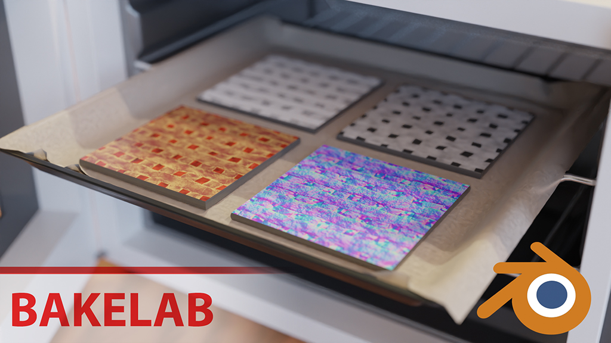
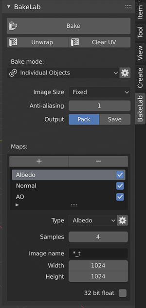

# Blender-BakeLab2

BakeLab - A blender addon for baking images. 
Compatible with Blender 5.0 or higher.

**Fork:** https://github.com/CloudyTabzy/Blender-BakeLab2

Main Features:
* Automatically create images, setup materials, bake objects and save/pack images in one click;
* Automatically generating materials;
* Anti-Aliased baking;
* Baking cycles displacement to real geometry;
* Bake any PBR attributes of your material by its name (Metallic, Roughness, Specular and etc);
* Adaptive image size by object's surface size;
* Unwrap and Bake Multiple Objects into one image;
* Per-map clear image option for transparent backgrounds;
* Max ray distance support for improved baking control;

