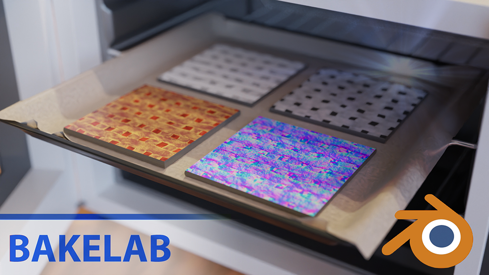
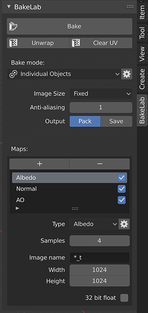

# Blender-BakeLab2

BakeLab - A blender addon for baking images.<br>
Compatible with Blender 5.0 or higher.

**Fork:** https://github.com/CloudyTabzy/Blender-BakeLab2

Main Features:
* Automatically create images, setup materials, bake objects and save/pack images in one click;
* Automatically generating materials;
* Anti-Aliased baking;
* Baking cycles displacement to real geometry;
* Bake any PBR attributes of your material by its name (Metallic, Roughness, Specular and etc);
* Adaptive image size by object's surface size;
* Unwrap and Bake Multiple Objects into one image;
* **Per-map clear image option for transparent backgrounds**;
* **Max ray distance support for improved baking control**;
* **Blender 5.0+ exclusive compatibility with modern API features**;
* **Blender Extensions manifest for official extension support**;



## Installation

1. Download or build the extension zip (see below).
2. In Blender, go to *Edit > Preferences > Get Extensions*, open the drop-down at the top right and choose *Install from Disk...*.
3. Find the **BakeLab** tab in the 3D View sidebar (*N*).

### Building the zip

From the repository folder, run:

```
blender --command extension build
```

This writes `blender_bakelab-<version>.zip`, containing only the files the add-on needs.

## Changes in 2.1.0

* Fixed Blender freezing on materials with node groups that have no Group Input
* Fixed crashes: Transmission maps, Adaptive image size, editing Min/Max Size, Selected to Active without an active object
* Original materials are no longer deleted when baking linked duplicates
* Saved images keep their exact colors (the scene's AgX view transform is no longer applied) and still show after reopening the .blend
* Transparent backgrounds (*Clear image*) are kept when saving, packing and exporting
* Pre-Join Meshes works again, and cancelling with *Esc* restores materials
* Subsurface maps now bake the material's Subsurface Weight
* All To One no longer wipes earlier objects, and Max Ray Distance is its own setting
* Adaptive size applies each map's Image Scale; reused images are resized to the map size

See [TESTING.md](TESTING.md) for the release test checklist.
