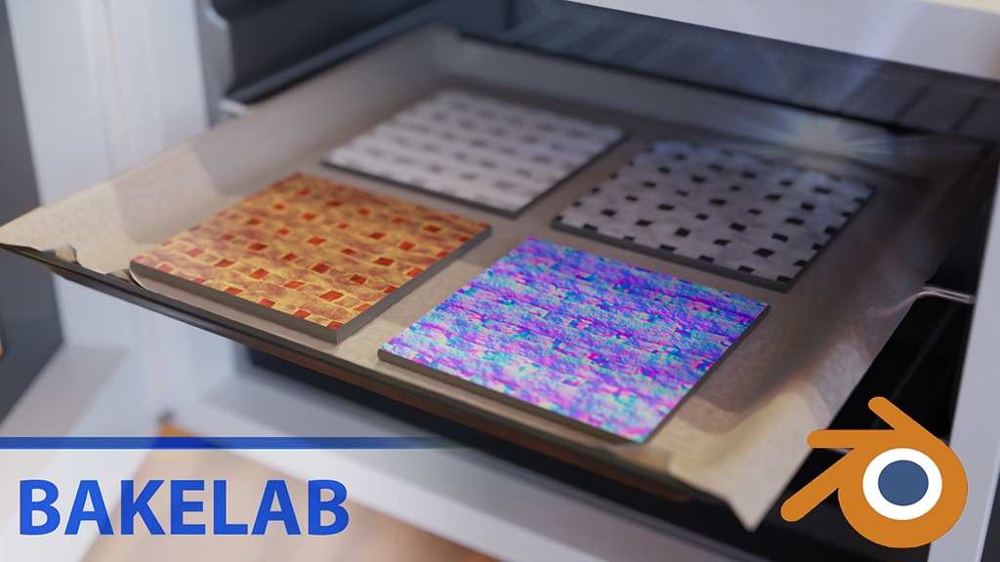
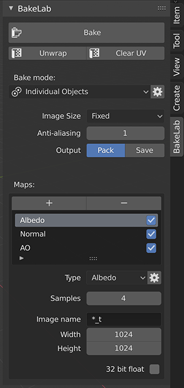

# BakeLab 2



**Texture baking, minus the busywork.** Point BakeLab at your objects and it
creates the images, prepares the materials, bakes every map and packs or
saves the results — all from one button.

Compatible with **Blender 4.2 LTS → 5.2** from a single build ·
Current release **3.7.0** · [Changelog](CHANGELOG.md)

**Fork:** https://github.com/CloudyTabzy/Blender-BakeLab2

## ✨ Features

### 🚀 One-click pipeline

* Creates the target images, sets up bake materials, bakes and packs/saves —
  one click, no manual wiring.
* **Preflight checklist** shows exactly what a bake will do before it runs —
  mesh selection, missing UVs (named), map counts, batch conflicts — and
  greys out Bake while something blocks it.
* Smart fallbacks: an empty map list auto-adds a default Albedo map, and a
  wired alpha input auto-adds an Alpha map — both announced, never silent.
* **Generate Materials** rebuilds clean PBR materials wired to the baked
  maps, including Alpha (with transparency enabled) and channel-split AORM.
* Unwrap helpers, Cycles displacement baked to real geometry, and
  Selected-to-Active / All-To-One workflows.
* **Clean Leftovers** recovers a scene after an interrupted bake —
  re-points stranded material copies to their originals and clears temp
  objects, nodes and a stuck bake state.
* **Import Textures**: point at texture files named `sword_albedo.png` /
  `sword_roughness.png` and they're loaded and wired into the matching
  object's material — every PBR channel, AORM splitting, UDIM tiles, and
  correct color spaces included.

### 🗺️ Maps for every pipeline

* Full PBR set: Albedo, Normal, Roughness, Metallic, Specular, Emission,
  Alpha, Ambient Occlusion…
* **AORM packed map** — AO → R, Roughness → G, Metallic → B in a single
  pass, Unreal/Unity style.
* **Material ID** — a stable, distinct color per material for masking and
  selection work.
* **Position** — world-space surface coordinates, EXR-ready.
* **UV & Color grids** — bake the classic test patterns through your UVs
  to spot stretching at a glance; they wire onto the model for inspection.
* **Custom Pass** — bake any shader socket or named attribute by its name.
* Per-map control: fixed or **adaptive** size from surface area,
  anti-aliasing supersampling, clear-image transparency, max ray distance.

### 📦 Batch & automation

* Batch by **selection, material, collection or scene** — a failing job is
  reported and skipped, never kills the queue.
* **High–Low pairs**: name meshes `foo_low` / `foo_high*` and each low is
  baked selected-to-active from its matching highs — no manual pairing.
  Variants scope the match (`chest_low_1` ← `chest_high_1`), and a bare
  `foo_low` collects every `foo_high*`.
* **UDIM-aware** baking: one image per UV tile, auto-detected, saved per tile.
* **Headless baking**: run whole batches from `blender -b` scripts.

### 🛠️ Built to last

* One build runs on Blender 4.2 LTS through 5.2 — version differences are
  handled by capability detection, not version checks.
* **Pick your GPU backend** — the add-on preferences expose Cycles'
  compute backends (OptiX, CUDA, HIP, oneAPI, Metal — whatever your
  machine offers), applied automatically whenever Device is GPU Compute.
* Ships as an official **Blender extension** — install from disk and go.



## 📥 Installation

1. Grab `blender_bakelab-<version>.zip` from a [release](../../releases) or
   build it yourself (below).
2. In Blender: *Edit → Preferences → Get Extensions*, open the top-right
   drop-down and choose *Install from Disk…*.
3. Open the **BakeLab** tab in the 3D View sidebar (*N*) — the checklist
   tells you whether your scene is ready to bake.

### 🔨 Building the zip

From the repository folder (or a checkout of a release tag), run:

```
blender --command extension build
```

This writes `blender_bakelab-<version>.zip`, containing only the files the
add-on needs.

## 📋 Changelog

Release history lives in [CHANGELOG.md](CHANGELOG.md).
